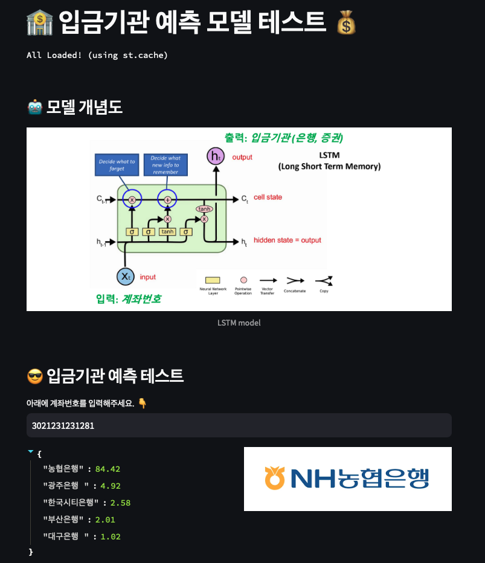

# 🏦 입금기관 추천 모델

계좌번호 입력을 기반으로 입금기관(은행/증권사)을 예측하는  
**Multi-class Classification 모델**입니다.

- 총 대상 기관: **52개**
  - 은행: 25
  - 증권사: 27

---

## 📊 Model Overview

- Architecture: **LSTM (Multi-class Classification)**
- Performance:
  - **v5**: 91.35% (Test Accuracy)
  - **v3**: 89.81% (Test Accuracy)

---

## ⚙️ Environment

- Python: **3.10.10**

---

## 🚀 Demo

👉 https://ugewwgebqq6ow5fdjkm5he.streamlit.app/

---

## 📌 Model Release History

| Phase | Freezing Date | Deployment Date | Key Content | # of Data |
|------|--------------|----------------|----------------|----------------|
| 1st  | 2024-10-06   | 2024-11-30     |  | 약 460만 건 |  
| 2nd  | 2025-12-02   | 2026-04-03     | NH농협 당좌예금계좌 개선(108-06-xxxxxx) 및 신규 패턴 반영 | 약 1,000만 건  | 

---

## 📝 Notes

- 계좌번호 패턴 기반으로 금융기관을 분류하는 문제로, 시계열/문자열 패턴 학습을 위해 LSTM을 적용
- 지속적인 데이터 업데이트 및 모델 성능 개선 진행 중
